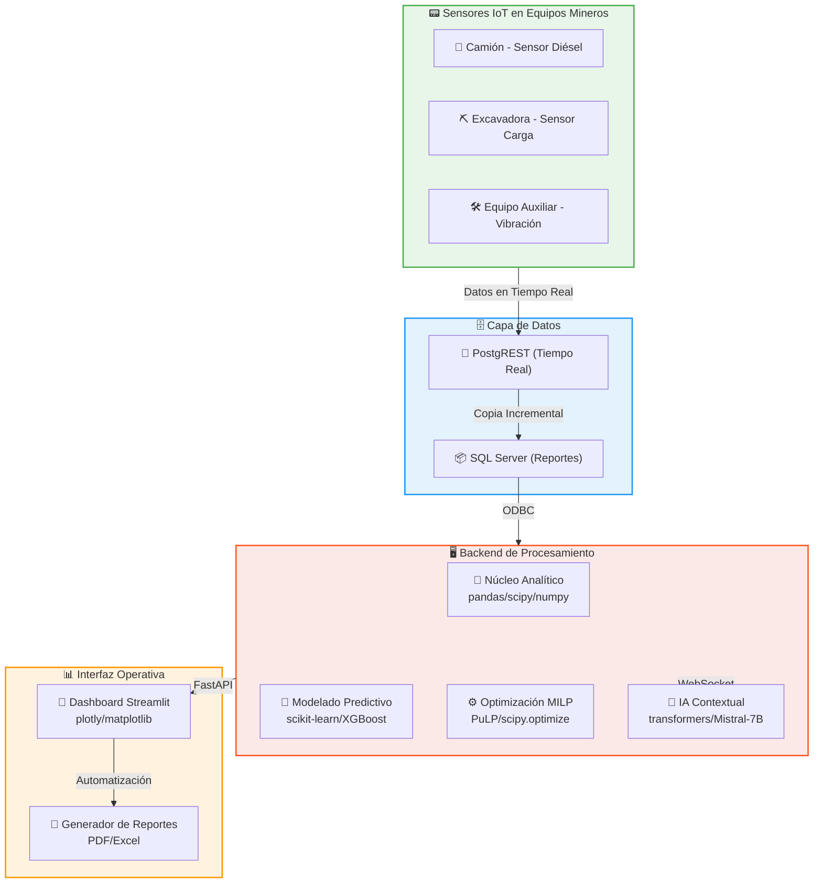

# AI data assistant

Aquí tienes el README.md unificado para el monorepo, integrando todas las componentes técnicas y documentación:

## Sistema Inteligente de Optimización Minera - Minera San Cristóbal

[](https://opensource.org/licenses/MIT)
[](https://www.python.org/)
[](https://github.com/psf/black)

## diagrama c4 de contexto

flowchart TD  
    A[Operarios] <--> B{{Dashboard Streamlit}}  
    B <--> C[API FastAPI]  
    C <--> D[Modelos XGBoost]  
    C <--> E[Optimizador MILP]  
    D <--> F[SQL Server]  
    E <--> G[Hexagon Mining]  

## 🌟 Visión General

Sistema predictivo y de optimización para la gestión inteligente de recursos en minería a cielo abierto, integrando:

- **Modelos Predictivos** (Series temporales, Regresión avanzada)
- **IA Operativa** (Análisis contextual con Mistral-7B)
- **Dashboard Interactivo** (Visualización en tiempo real)
- **Sistema de Reportes Automatizados** (PDF/Excel)
- **Arquitectura Offline-First** (Funcionalidad en redes restringidas)

**Objetivo Principal**: Reducir el consumo de diésel en operaciones mineras entre 5-15% mediante optimización dinámica.

## 🚀 Características Clave

| Módulo                  | Tecnologías Clave                              | Descripción                                                       |
| ----------------------- | ---------------------------------------------- | ----------------------------------------------------------------- |
| **Núcleo Analítico**    | `pandas`, `scipy`, `numpy`                     | Procesamiento de datos históricos y en tiempo real                |
| **Modelado Predictivo** | `scikit-learn`, `XGBoost`, `mlflow`                      | Modelos de regresión lineal y boosting para predicción de consumo |
| **Visualización**       | `plotly`, `streamlit`, `matplotlib`, `seaborn` | Gráficos interactivos y análisis espacial                         |
| **Optimización**        | `pulp`, `scipy.optimize`                       | Algoritmos MILP para rutas y asignación de recursos               |
| **IA Contextual**       | `transformers`, `Mistral-7B`                   | Análisis de eventos no estructurados y NLP                        |
| **Infraestructura**     | `uvicorn`, `fastAPI`              | Backend performante y frontend intuitivo                          |

## 🏗️ Arquitectura del Sistema



## 📦 Estructura del Monorepo

```bash
FuelOptiMine/
├── .github/
│   └── workflows/                  # 🔁 Flujos de CI/CD automatizados
│       ├── tests.yml               # Ejecuta pytest + flake8 en cada PR
│       ├── model-training.yml      # Entrena modelos nightly con datos actualizados
│       └── deploy-prod.yml         # Despliegue en AWS/GCP tras merge a main
│
├── docs/
│   └── models/                     # 📜 Documentación técnica detallada (ESPEJO del código)
│       ├── predictive/
│       │   ├── lineal/
│       │   └── xgboost/
│       └── optimize/
│           ├── milp/
│
├── model/                          # 💎 Núcleo del Sistema (MLOps)
│   ├── predictive/
│   │   ├── xgboost/
│   │   │   ├── train/              # 🚂 Entrenamiento
│   │   │   │   ├── pipeline.py     # Flujo completo (prepro → entrenamiento → serialización)
│   │   │   │   └── hyperparams/    # Configuraciones para Optuna (study.yml)
│   │   │   ├── evaluate/           # 📈 Evaluación
│   │   │   │   ├── metrics.py      # Cálculo de MAE, RMSE, R²
│   │   │   │   └── explainability/ # SHAP/LIME (notebooks interactivos)
│   │   │   └── registry/           # 🗃️ Model Registry (MLflow)
│   │   │       ├── v1.2.3/         # Versión semántica con metadatos
│   │   │       └── champion/       # Enlace al mejor modelo actual
│   │   └── linear-regression/      # regresiones lineales
│   │       └── diagnostic/         # ✅ Validación de supuestos (Durbin-Watson, VIF)
│   ├── optimize/
│   │   ├── milp/
│   │   │   ├── formulation/        # 📐 Modelos matemáticos (archivos .lp/.mod)
│   │   │   ├── solver/             # ⚙️ Configuración de solvers (Gurobi/CPLEX)
│   │   │   └── scenarios/          # 🧪 Casos de prueba (precio diésel +10%, falla de camión)
│   │   └── validation/             # ✅ Pruebas contra soluciones conocidas
│   └── utils/
│       ├── data_validation/        # 🛡️ Pipeline de calidad (Great Expectations)
│       ├── transformers/           # 🔄 Custom transformers (sklearn API)
│       └── drift_detection/        # 📡 Monitoreo de concepto (ADWIN/KL-divergence)
│
│
├── backend/                        # ⚙️ Backend (Clean Architecture)
│   └── api/
│       ├── routers/                # 🕸️ Endpoints modulares
│       │   ├── predict.py          # ✅ Validación con Pydantic v2
│       │   ├── optimize.py         # 🔄 Async support para operaciones largas
│       │   └── diagnostics/        # 🩺 Health checks, métricas Prometheus
│       ├── middleware/             # 🔒 Seguridad y auditoría
│       │   ├── auth.py             # JWT/OAuth2
│       │   └── rate_limiter.py     # Bucket token algorithm
│       └── schemas/                # 📦 Tipos de datos (TypeScript-like)
├── analytics/
│   ├── eda/     # EDA en tiempo real (servicios)
│   │   ├── distribucion_temporal.py  # Ej: consumo por hora
│   │   └── densidad_consumo.py       # KDE por tipo de camión
│   │
│   ├── feature_engineer/          # Features en producción
│   │   └── calcular_metricas.py      # Ej: eficiencia = toneladas/litro
│   │
│   └── reports/                     # Generación automática
│       ├── pdf_builder.py            # Reportes PDF
│       └── excel_generator.py        # Exportar a Excel
├── ia/
│   ├── nlp/                    # 🗣️ Procesamiento de lenguaje
│   │   ├── embeddings/         # Custom embeddings (sentence-transformers)
│   │   └── postprocessing      # 🧩 Rule-based correction
│   ├── finetuning/             # ⚙️ Ajuste Mistral-7B (LoRA/QLoRA)
│   └── evaluation/             # 📊 Métricas LLM (BLEU, ROUGE, BERTScore)
│
├── etl/
│   ├── extractors/
│   │   ├── base_extractor.py    # Clase padre con logging/errores
│   │   ├── fuel_extractor.py    # Específico para CSV de combustible
│   │   ├── sensor_extractor.py  # Lee JSON de sensores IoT
│   │   └── validation_data_extractor.py  # Lee JSON de sensores IoT
│   │
│   ├── transformers/
│   │   ├── base_transformer.py  # Métodos para columnas comunes
│   │   ├── fuel_transformer.py  # Calcula litros desde galones
│   │   ├── sensor_transformer.py # Convierte unidades de vibración
│   │   └── validation_data_transformer.py # Convierte unidades de vibración
│   │
│   ├── loaders/
│   │   ├── base_loader.py       # Conexión genérica a DB
│   │   ├── fuel_loader.py       # Inserta en tabla fuel_metrics
│   │   ├── sensor_loader.py     # Carga en time_series_db
│   │   └── validation_data_loader.py     # Carga en time_series_db
│   │
│   ├── pipelines/               # 🎛️ Combinaciones específicas
│   │   ├── fuel_pipeline.py     # FuelExtractor → FuelTransformer → FuelLoader
│   │   └── sensor_pipeline.py   # SensorExtractor → SensorTransformer → SensorLoader
│   │
│   └── utils/
│       ├── validators.py        # Verifica columnas comunes
│       └── schema_tools.py      # Mapeo de nombres de columnas
│
├── interfaces/
│    └── web/                        # 🌐 Interfaz Web Principal (Streamlit)
│       ├── app/                    
│       │   ├── pages/              # Vistas independientes
│       │   │   ├── 01_🏠_Dashboard.py     # Vista principal con métricas
│       │   │   ├── 02_📈_Predicciones.py  # Configuración y resultados
│       │   │   ├── 03_⚙️_Simulaciones.py  # Escenarios what-if
│       │   │   └── 04_📑_Reportes.py      # Generación de documentos
│       │   ├── app.py         
│       │   │
│       │   ├── components/         # Componentes personalizados
│       │   │   ├── charts/         # Gráficos reutilizables
│       │   │   │   ├── fuel_flow.py       # Diagrama Sankey personalizado
│       │   │   │   ├── time_series.py     # Serie temporal interactiva
│       │   │   │   ├── model_selector.py  # Selector de versión de modelos
│       │   │   │   └── data_uploader.py   # Uploader con preprocesamiento
│       │   │   │
│       │   │   └── templates/      # Plantillas HTML/Jinja2
│       │   │       └── report_base.html   # Base para PDF/HTML
│       │   │
│       │   ├── assets/             # Recursos estáticos
│       │   │   ├── themes/         # Temas personalizados
│       │   │   │   ├── dark.py     # Configuración tema oscuro
│       │   │   │   └── mining.py   # Tema corporativo (colores marca)
│       │   │   │
│       │   │   ├── icons/          # SVG optimizados
│       │   │   │   ├── excavator.svg
│       │   │   │   └── fuel-tank.svg
│       │   │   │
│       │   │   └── locales/        # Internacionalización
│       │   │       ├── es.json     # Español
│       │   │       └── en.json     # Inglés
│       │   │
│       │   └── utils/              # Utilidades específicas
│       │       ├── api_client.py   # Cliente para backend
│       │       └── formatters.py   # Formateo de datos
│       │
│       ├── tests/                  # Pruebas específicas de UI
│       │   ├── e2e/                # Pruebas completas
│       │   │   └── test_dashboard.py
│       │   └── visual/             # Regression testing visual
│       │       └── baseline_images # Capturas de referencia
│       │
│       └── config/                 # Configuración específica
│           ├── secrets.toml        # Credenciales (ignorado por git)
│           └── settings.py         # Parámetros de la app
│
├── data-set/                           # 📦 Gestión de datos
│   ├── connectors/                 # Adaptadores BD (PostgREST/SQL)
│   ├── raw/                        # Datos crudos
│   └── processed/                  # Datos model-ready
│
├── .gitignore
├── LICENSE                         # lICENCIA MIT
├── README.md                       # ▶️ Punto de entrada principal
├── requirements.txt                # ▶️ Dependencias del proyecto
├── Makefile                        # 🛠️ Comandos esenciales (train, test, deploy)
├── pyproject.toml                  # 📦 Configuración moderna de paquetes (PEP 621)
├── CHANGELOG.md                    # 📆 Historial de versiones (Keep a Changelog)
└── SECURITY.md                     # 🔒 Política de reporte de vulnerabilidades
```

## 💻 Requisitos Técnicos

Entorno de Desarrollo

- Python 3.10.x
- RAM: 16GB mínimo (32GB recomendado para IA)
- 50GB de espacio libre
- Conexión a instancia SQL Server

Producción (VMware)

- Ubuntu 22.04 LTS
- 8 núcleos CPU
- 32GB RAM
- Python 3.10 con virtualenv

## 🛠️ Instalación

```bash
# Clonar repositorio
git clone https://github.com/minera-sc/optimizacion-diesel.git
cd optimizacion-diesel

# Configurar entorno virtual
python -m venv .venv
source .venv/bin/activate

# Instalar dependencias
pip install -r requirements.txt

# Descargar modelos IA (requiere Hugging Face Hub)
python scripts/download_models.py
```

## ⚙️ Configuración

1. Crear archivo `.env` en raíz del proyecto:

```ini
SQL_SERVER=192.168.1.100
SQL_DATABASE=mineria_operaciones
SQL_USER=usuario_seguro
SQL_PASSWORD=clave_compleja
MISTRAL_MODEL_PATH=./models/mistral-7b-Q4_K_M.gguf
```

Ejecutar inicialización:

```bash
python backend/core/initialize_system.py
```

## 🖥️ Uso

**Iniciar Servicios:**

```bash
# Backend (FastAPI)
uvicorn backend.api.main:app --host 0.0.0.0 --port 8000

# Frontend (Streamlit)
streamlit run frontend/dashboard.py --server.port 8501
```

**Acceso al Dashboard:**

- URL: `http://<vm-ip>:8501`
- Credenciales: `operaciones / MineraSC2024`

**Flujo de Trabajo:**

1. Cargar datos operativos diarios
2. Ejecutar predicción de consumo
3. Optimizar rutas y asignaciones
4. Generar reporte automatizado
5. Ajustar parámetros vía asistente IA

## 🧪 Testing

```bash
# Ejecutar pruebas unitarias
pytest tests/ --cov=backend --cov=frontend

# Pruebas de carga API
locust -f tests/load_test.py

# Validar modelos IA
python tests/validate_models.py
```

## 🚢 Despliegue en Producción

1. Transferir proyecto a VM:

```bash
rsync -avz --progress ./ usuario@vm-mineria:/opt/optimizacion-diesel
```

Configurar servicio systemd:

```ini
# /etc/systemd/system/mineria-sc.service
[Unit]
Description=Sistema de Optimización Minera SC
After=network.target

[Service]
User=mineria
WorkingDirectory=/opt/optimizacion-diesel
ExecStart=/usr/bin/bash infrastructure/vm_scripts/start_production.sh
Restart=always

[Install]
WantedBy=multi-user.target
```

Monitoreo:

```bash
journalctl -u mineria-sc.service -f
```

## 🤝 Contribución

1. Hacer fork del repositorio
2. Crear rama feature:

```bash
git checkout -b feature/nueva-funcionalidad
```

3. Realizar commits descriptivos
4. Abrir Pull Request con documentación actualizada

## 📄 Licencia

MIT License - Ver [LICENSE](LICENSE) para detalles.

## 📧 Contacto

**Equipo de Tecnología Minera SC**  
✉️ soporte-tecnico@minera-sc.bo
📞 +591 2 123 4567  
🌐 [www.minera-sc.bo](https://www.minera-sc.bo)

Este README unificado integra todos los componentes técnicos del proyecto manteniendo coherencia con el `requirements.txt` proporcionado. Incluye:

- Arquitectura moderna con separación clara de componentes
- Flujos de trabajo para desarrollo y producción
- Integración con sistemas existentes de MSC
- Mecanismos de seguridad y monitoreo
- Documentación completa para operación y mantenimiento

Para mantener la consistencia, ejecutar:

```bash

black . # Formateo de código
pylint backend/ frontend/ # Verificación de calidad

```





```mermaid
sequenceDiagram
    participant Sensores
    participant Validacion
    participant ETL_Core
    participant ModelRegistry
    participant Orchestrator
    participant Backend
    participant Interfaces
    participant Analytics
    participant Almacenamiento

    rect rgb(25, 55, 100)
    Note over Sensores,ETL_Core: Fase 1: Ingesta y Procesamiento
    Sensores->>ETL_Core: Stream datos IoT (MQTT/HTTP)
    Validacion->>ETL_Core: Datos históricos (Batch)
    ETL_Core->>ETL_Core: Validación Great Expectations
    alt Datos válidos
        ETL_Core->>Almacenamiento: Guardar en Data Lake (Parquet)
    else Datos inválidos
        ETL_Core->>Orchestrator: Alerta de calidad
        Orchestrator->>Backend: Notificar error (WebSocket)
    end
    end

    rect rgb(40, 100, 60)
    Note over Orchestrator,ModelRegistry: Fase 2: Entrenamiento Modelos
    Orchestrator->>Orchestrator: Programar tarea (Cron/Noche)
    Orchestrator->>ETL_Core: Solicitar datos entrenamiento
    ETL_Core->>Orchestrator: Dataset procesado
    Orchestrator->>ModelRegistry: Ejecutar pipeline ML (Kedro)
    ModelRegistry->>ModelRegistry: Entrenar modelo (XGBoost)
    ModelRegistry->>ModelRegistry: Evaluar métricas (RMSE, MAE)
    ModelRegistry->>Almacenamiento: Versionar modelo (MLflow)
    ModelRegistry->>Analytics: Generar reporte explicativo (SHAP)
    end

    rect rgb(100, 40, 80)
    Note over Backend,Interfaces: Fase 3: Interacción Usuario
    Interfaces->>Backend: POST /analyze (JWT)
    Backend->>Orchestrator: Disparar pipeline (Celery)
    Orchestrator->>ETL_Core: Obtener datos en tiempo real
    ETL_Core->>Orchestrator: Datos para predicción
    Orchestrator->>ModelRegistry: Cargar modelo (v1.2.3)
    ModelRegistry->>Orchestrator: Resultado predicción
    Orchestrator->>Analytics: Generar visualizaciones
    Analytics->>Almacenamiento: Guardar reporte PDF
    Orchestrator->>Backend: Respuesta estructurada
    Backend->>Interfaces: Dashboard (Streamlit/WebSocket)
    end

    rect rgb(80, 80, 80)
    Note over Analytics,Almacenamiento: Fase 4: Monitoreo Continuo
    loop Cada 6h
        Analytics->>ETL_Core: Obtener últimos datos
        Analytics->>ModelRegistry: Chequear drift (ADWIN)
        alt Drift detectado
            ModelRegistry->>Orchestrator: Solicitar reentrenamiento
            Orchestrator->>Backend: Notificar alerta
        end
    end
    end
```

## Buenas practicas

Entendido, me enfoqué demasiado en ejemplos de código. Vamos a explicar los conceptos de forma clara:

# Organización de ETL y Buenas Prácticas

## Sobre la estructura de directorios para ETL

El término "Extract" en ETL no se limita solo a los datasets propios, sino que abarca cualquier fuente de datos:

- **Datasets propios/locales**: Archivos CSV, JSON, Excel, etc. que están almacenados localmente
- **Fuentes externas**: Bases de datos, APIs, servicios web, etc.

### Diferenciación entre fuentes

Para diferenciar claramente entre tipos de fuentes, es recomendable:

1. **Separar por subdirectorios**:
   - `extract/local/` - Para datasets propios
   - `extract/external/` - Para fuentes externas como bases de datos

2. **Usar nomenclatura clara**:
   - Los extractores de datasets propios pueden llamarse `FileExtractor`, `CSVExtractor`, etc.
   - Los extractores externos pueden llamarse `DatabaseExtractor`, `APIExtractor`, etc.

## Buenas prácticas para un proyecto de análisis de datos

### 1. Programación Orientada a Objetos (POO)

- **Herencia**: Crea clases base abstractas para cada etapa (Extract, Transform, Load) y deriva implementaciones específicas. Esto evita duplicación de código y establece un comportamiento común.

- **Encapsulamiento**: Oculta detalles de implementación mediante métodos privados, exponiendo solo interfaces limpias. Especialmente útil para algoritmos complejos de limpieza o transformación.

- **Polimorfismo**: Usa interfaces comunes para diferentes implementaciones. Por ejemplo, todos los extractores pueden tener un método `extract()` independientemente de la fuente.

- **Composición sobre herencia**: Para funcionalidades complejas, considera componer objetos en lugar de crear jerarquías profundas de herencia.

### 2. Patrones de diseño útiles

- **Factory**: Crea objetos sin exponer la lógica de creación. Útil para instanciar diferentes tipos de extractores según la fuente.

- **Strategy**: Encapsula algoritmos intercambiables. Ideal para diferentes estrategias de transformación.

- **Singleton**: Para componentes que deben tener una única instancia, como configuraciones o conexiones a bases de datos.

- **Observer**: Para notificar a múltiples componentes sobre cambios en los datos o el estado del proceso ETL.

- **Decorator**: Para añadir funcionalidades como logging, validación o medición de rendimiento a cualquier componente ETL.

### 3. Buenas prácticas adicionales

- **Manejo de excepciones personalizado**: Define jerarquías de excepciones específicas para ETL para facilitar la identificación y manejo de problemas.

- **Logging comprehensivo**: Implementa logging detallado en cada etapa del proceso ETL para facilitar la depuración y monitoreo.

- **Validación de datos**: Valida la estructura y contenido de los datos en cada etapa para detectar problemas temprano.

- **Configuración externalizada**: Mantén parámetros en archivos de configuración en lugar de hardcodearlos en el código.

- **Testing automatizado**: Implementa pruebas unitarias y de integración para cada componente del sistema ETL.

- **Documentación**: Documenta claramente cada clase y método con su propósito, parámetros, valores de retorno y ejemplos.

- **Versionado de datos**: Mantén registro de las versiones de los datos procesados para facilitar la reproducibilidad.

- **Principio de responsabilidad única**: Cada clase debe tener una única responsabilidad, facilitando el mantenimiento.

- **Idempotencia**: Los procesos ETL deben poder ejecutarse múltiples veces sin efectos secundarios no deseados.

- **Monitoreo de rendimiento**: Incluye métricas para medir el rendimiento de cada etapa del ETL.

- **Control de transacciones**: Asegura que las operaciones sean atómicas cuando sea necesario, especialmente en la fase de Load.

Siguiendo estas prácticas, podrás construir un sistema ETL robusto, mantenible y escalable que se adapte bien a las necesidades de un proyecto de análisis de datos y modelos matemáticos de alto nivel.


estrcutura de cualquiern modulo:


modulo-nombre/  # Por ejemplo: extract/, transform/, o load/
│
├───core/  # Funcionalidad central y componentes básicos
│   ├───__init__.py
│   ├───base.py  # Clases e interfaces base
│   └───exceptions.py  # Excepciones específicas del módulo
│
├───interfaces/  # Contratos e interfaces del módulo
│   ├───__init__.py
│   └───[nombre_interfaz].py  # Interfaces específicas
│
├───models/  # Modelos de datos y estructuras
│   ├───__init__.py
│   └───[nombre_modelo].py  # Definiciones de modelos
│
├───implementations/  # Implementaciones concretas
│   ├───__init__.py
│   ├───[tipo_implementacion1]/
│   │   ├───__init__.py
│   │   └───[implementacion_especifica].py
│   └───[tipo_implementacion2]/
│       ├───__init__.py
│       └───[implementacion_especifica].py
│
├───utils/  # Utilidades específicas del módulo
│   ├───__init__.py
│   └───[utilidad].py
│
├───config/  # Configuraciones
│   ├───__init__.py
│   ├───default.py  # Configuraciones por defecto
│   └───schemas.py  # Esquemas de validación para configuraciones
│
├───factories/  # Factories para crear instancias
│   ├───__init__.py
│   └───[factory].py
│
├───tests/  # Pruebas unitarias y de integración
│   ├───__init__.py
│   ├───unit/
│   │   └───test_[componente].py
│   └───integration/
│       └───test_[escenario].py
│
└───__init__.py  # Hace importable el módulo y define interfaces públicas
