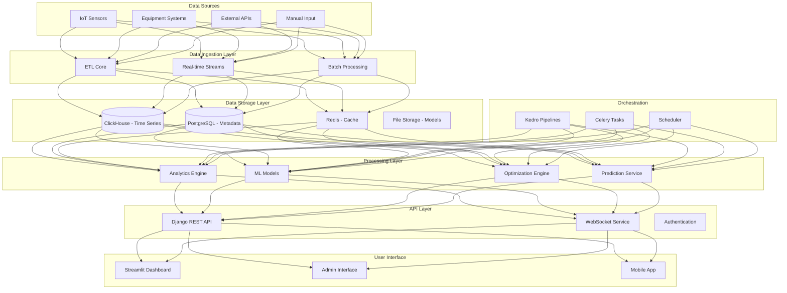
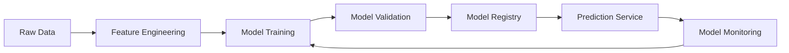
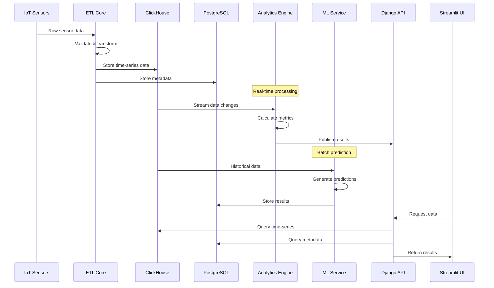

# System Architecture

This document provides a comprehensive overview of the FuelOptiMine system architecture, design patterns, and technical implementation details.

## 🏗️ High-Level Architecture

### System Overview

FuelOptiMine follows a **microservices-inspired modular architecture** with clear separation of concerns:



### Core Principles

1. **Modularity**: Each component has a single responsibility
2. **Scalability**: Horizontal scaling capability
3. **Reliability**: Fault tolerance and error recovery
4. **Performance**: Optimized for real-time processing
5. **Maintainability**: Clean code and clear interfaces
6. **Security**: Authentication, authorization, and data protection

## 🔧 Component Architecture

### 1. ETL Core Module

**Purpose**: Extract, Transform, and Load data from various sources

```
etl_core/
├── extract/
│   ├── interfaces/           # Abstract base classes
│   ├── implementations/      # Concrete extractors
│   │   ├── local/           # Local file extractors
│   │   └── external/        # Database/API extractors
│   ├── factories/           # Factory pattern for extractor creation
│   └── config/              # Configuration schemas
├── transform/
│   ├── core/                # Base transformation classes
│   ├── implementations/     # Specific transformers
│   └── validators/          # Data validation rules
└── load/
    ├── destinations/        # Output destinations
    └── serializers/         # Data format serializers
```

**Design Patterns Used:**
- **Factory Pattern**: For creating appropriate extractors
- **Strategy Pattern**: For different transformation algorithms
- **Template Method**: For common ETL workflows
- **Observer Pattern**: For data quality monitoring

**Key Features:**
- Type-safe data extraction with Pydantic validation
- Pluggable transformation pipeline
- Automatic data quality checks
- Error handling and recovery
- Progress monitoring and logging

### 2. Analytics Engine

**Purpose**: Real-time data analysis and metric calculation

```python
# Example: Analytics Service Architecture
class AnalyticsEngine:
    def __init__(self):
        self.aggregators = {
            'fuel_consumption': FuelConsumptionAnalyzer(),
            'efficiency': EfficiencyAnalyzer(),
            'equipment_status': EquipmentStatusAnalyzer()
        }
    
    async def process_realtime_data(self, data_stream):
        """Process incoming data stream."""
        async for data_point in data_stream:
            results = await self.analyze_data_point(data_point)
            await self.publish_results(results)
    
    def analyze_data_point(self, data):
        """Apply all relevant analyzers to data point."""
        results = {}
        for name, analyzer in self.aggregators.items():
            if analyzer.can_process(data):
                results[name] = analyzer.analyze(data)
        return results
```

**Components:**
- **Real-time Aggregators**: Calculate rolling metrics
- **Pattern Detection**: Identify trends and anomalies
- **Event Processing**: Handle alerts and notifications
- **Caching Layer**: Redis for fast metric retrieval

### 3. Machine Learning Pipeline

**Purpose**: Predictive modeling and AI-powered optimization



**Model Architecture:**

```python
class FuelPredictionModel:
    """XGBoost-based fuel consumption prediction."""
    
    def __init__(self, config: ModelConfig):
        self.model = None
        self.feature_pipeline = self._build_feature_pipeline()
        self.config = config
    
    def _build_feature_pipeline(self):
        """Create feature engineering pipeline."""
        return Pipeline([
            ('temporal_features', TemporalFeatureExtractor()),
            ('equipment_features', EquipmentFeatureExtractor()),
            ('weather_features', WeatherFeatureExtractor()),
            ('scaler', StandardScaler())
        ])
    
    def train(self, training_data: pd.DataFrame):
        """Train the prediction model."""
        X = self.feature_pipeline.fit_transform(training_data)
        y = training_data['fuel_consumption']
        
        self.model = XGBRegressor(**self.config.model_params)
        self.model.fit(X, y)
        
        return self.evaluate(X, y)
    
    def predict(self, input_data: pd.DataFrame) -> np.ndarray:
        """Generate fuel consumption predictions."""
        X = self.feature_pipeline.transform(input_data)
        return self.model.predict(X)
```

### 4. API Layer (Django)

**Purpose**: RESTful API for system access and integration

```python
# API Architecture Example
class FuelDataViewSet(viewsets.ModelViewSet):
    """Fuel data API with real-time capabilities."""
    
    queryset = FuelReading.objects.all()
    serializer_class = FuelReadingSerializer
    permission_classes = [IsAuthenticated]
    filterset_class = FuelDataFilter
    
    @action(detail=False, methods=['get'])
    def realtime(self, request):
        """Get real-time fuel data via WebSocket."""
        return Response({
            'websocket_url': f'ws://{request.get_host()}/ws/fuel-data/',
            'authentication': 'Bearer token required'
        })
    
    @action(detail=False, methods=['post'])
    def predict(self, request):
        """Generate fuel consumption predictions."""
        serializer = PredictionRequestSerializer(data=request.data)
        serializer.is_valid(raise_exception=True)
        
        # Trigger async prediction task
        task = predict_fuel_consumption.delay(
            equipment_id=serializer.validated_data['equipment_id'],
            horizon=serializer.validated_data['horizon']
        )
        
        return Response({
            'task_id': task.id,
            'status': 'processing',
            'estimated_completion': timezone.now() + timedelta(minutes=5)
        })
```

**API Features:**
- JWT authentication and authorization
- Rate limiting and throttling
- Automatic API documentation with DRF Spectacular
- WebSocket support for real-time updates
- Async task processing with Celery
- Comprehensive error handling

### 5. Frontend Architecture (Streamlit)

**Purpose**: Interactive dashboard and user interface

```python
# Streamlit App Architecture
class DashboardApp:
    """Main dashboard application."""
    
    def __init__(self):
        self.api_client = APIClient()
        self.cache = st.cache_data
        self.session_state = st.session_state
    
    def render(self):
        """Render the main dashboard."""
        st.set_page_config(
            page_title="FuelOptiMine Dashboard",
            layout="wide",
            initial_sidebar_state="expanded"
        )
        
        # Sidebar navigation
        page = self.render_sidebar()
        
        # Main content area
        if page == "dashboard":
            self.render_main_dashboard()
        elif page == "analytics":
            self.render_analytics_page()
        elif page == "predictions":
            self.render_predictions_page()
    
    def render_main_dashboard(self):
        """Render the main dashboard with real-time data."""
        col1, col2, col3, col4 = st.columns(4)
        
        with col1:
            self.render_fuel_level_metric()
        with col2:
            self.render_consumption_rate_metric()
        with col3:
            self.render_efficiency_metric()
        with col4:
            self.render_active_vehicles_metric()
        
        # Real-time charts
        self.render_fuel_timeline_chart()
        self.render_equipment_status_map()
```

**Frontend Features:**
- Reactive UI with real-time updates
- Interactive charts with Plotly
- Mobile-responsive design
- State management across pages
- Efficient data caching
- Custom components and themes

## 🗄️ Data Architecture

### Database Design

#### ClickHouse (Time-Series Data)

```sql
-- Fuel readings table optimized for time-series queries
CREATE TABLE fuel_readings (
    timestamp DateTime64(3),
    equipment_id String,
    fuel_level_liters Float64,
    location_lat Float64,
    location_lon Float64,
    engine_status Enum8('running' = 1, 'idle' = 2, 'off' = 3),
    operator_id String,
    created_at DateTime DEFAULT now()
) ENGINE = MergeTree()
PARTITION BY toYYYYMM(timestamp)
ORDER BY (equipment_id, timestamp)
SETTINGS index_granularity = 8192;

-- Materialized view for real-time aggregations
CREATE MATERIALIZED VIEW fuel_hourly_mv TO fuel_hourly_aggregates AS
SELECT 
    toStartOfHour(timestamp) as hour,
    equipment_id,
    avg(fuel_level_liters) as avg_fuel_level,
    min(fuel_level_liters) as min_fuel_level,
    max(fuel_level_liters) as max_fuel_level,
    count() as reading_count
FROM fuel_readings
GROUP BY hour, equipment_id;
```

#### PostgreSQL (Metadata and Configuration)

```python
# Django models for metadata
class Equipment(models.Model):
    """Equipment/vehicle metadata."""
    equipment_id = models.CharField(max_length=50, unique=True)
    name = models.CharField(max_length=200)
    equipment_type = models.CharField(max_length=50)
    fuel_capacity = models.FloatField()
    max_payload = models.FloatField()
    manufacture_year = models.IntegerField()
    
    class Meta:
        db_table = 'equipment'
        indexes = [
            models.Index(fields=['equipment_type']),
            models.Index(fields=['equipment_id'])
        ]

class PredictionModel(models.Model):
    """ML model metadata and versioning."""
    name = models.CharField(max_length=100)
    version = models.CharField(max_length=20)
    model_type = models.CharField(max_length=50)
    accuracy_score = models.FloatField()
    training_date = models.DateTimeField()
    is_active = models.BooleanField(default=False)
    model_file_path = models.CharField(max_length=500)
    
    class Meta:
        db_table = 'prediction_models'
        unique_together = ['name', 'version']
```

### Data Flow Architecture



## 🔄 Processing Pipelines

### Kedro Pipeline Architecture

```python
def create_data_processing_pipeline() -> Pipeline:
    """Create the main data processing pipeline."""
    
    return Pipeline([
        # Data extraction nodes
        node(
            func=extract_sensor_data,
            inputs="raw_sensor_data",
            outputs="extracted_sensor_data",
            name="extract_sensors"
        ),
        
        # Data validation and cleaning
        node(
            func=validate_fuel_data,
            inputs="extracted_sensor_data",
            outputs="validated_fuel_data",
            name="validate_data"
        ),
        
        # Feature engineering
        node(
            func=engineer_features,
            inputs=["validated_fuel_data", "params:feature_config"],
            outputs="engineered_features",
            name="engineer_features"
        ),
        
        # Model training (conditional)
        node(
            func=train_prediction_model,
            inputs=["engineered_features", "params:model_config"],
            outputs="trained_model",
            name="train_model",
            tags=["training"]
        ),
        
        # Generate predictions
        node(
            func=generate_predictions,
            inputs=["engineered_features", "trained_model"],
            outputs="fuel_predictions",
            name="predict"
        ),
        
        # Store results
        node(
            func=store_predictions,
            inputs=["fuel_predictions", "params:storage_config"],
            outputs=None,
            name="store_results"
        )
    ])
```

### Celery Task Architecture

```python
# Async task processing
@shared_task(bind=True, max_retries=3)
def process_fuel_data_batch(self, batch_id: str):
    """Process a batch of fuel data asynchronously."""
    try:
        # Load batch data
        batch_data = get_batch_data(batch_id)
        
        # Process through pipeline
        pipeline = create_data_processing_pipeline()
        results = pipeline.run(batch_data)
        
        # Store results
        store_processed_results(results)
        
        return {
            'status': 'success',
            'batch_id': batch_id,
            'processed_records': len(batch_data)
        }
    
    except Exception as exc:
        # Retry logic
        if self.request.retries < self.max_retries:
            raise self.retry(countdown=60 * (2 ** self.request.retries))
        
        # Log failure and alert
        logger.error(f"Batch processing failed: {batch_id}", exc_info=exc)
        send_alert(f"Critical: Batch processing failed for {batch_id}")
        raise

@shared_task
def train_ml_models():
    """Scheduled task to retrain ML models."""
    models_to_train = get_models_requiring_training()
    
    for model_config in models_to_train:
        train_model_task.delay(model_config.id)

@shared_task
def generate_daily_reports():
    """Generate and distribute daily reports."""
    report_configs = get_active_report_configs()
    
    for config in report_configs:
        generate_report_task.delay(config.id, date.today())
```

## 🔐 Security Architecture

### Authentication and Authorization

```python
# JWT-based authentication
class CustomJWTAuthentication(JWTAuthentication):
    """Custom JWT authentication with enhanced security."""
    
    def authenticate(self, request):
        header = self.get_header(request)
        if header is None:
            return None
            
        raw_token = self.get_raw_token(header)
        if raw_token is None:
            return None
            
        validated_token = self.get_validated_token(raw_token)
        user = self.get_user(validated_token)
        
        # Additional security checks
        if not user.is_active:
            raise AuthenticationFailed('User account is disabled')
            
        # Check IP whitelist
        if not self.is_ip_allowed(request):
            raise AuthenticationFailed('IP not allowed')
            
        return (user, validated_token)

# Role-based permissions
class EquipmentPermission(BasePermission):
    """Permission to access equipment data."""
    
    def has_permission(self, request, view):
        if not request.user.is_authenticated:
            return False
            
        # Admin users have full access
        if request.user.is_superuser:
            return True
            
        # Check role-based permissions
        user_role = request.user.profile.role
        
        if view.action in ['list', 'retrieve']:
            return user_role in ['viewer', 'operator', 'analyst']
        elif view.action in ['create', 'update']:
            return user_role in ['operator', 'analyst']
        elif view.action == 'destroy':
            return user_role == 'analyst'
            
        return False
```

### Data Protection

```python
# Data encryption for sensitive fields
class EncryptedFuelReading(models.Model):
    """Fuel reading with encrypted sensitive data."""
    
    timestamp = models.DateTimeField()
    equipment_id = models.CharField(max_length=50)
    fuel_level = EncryptedFloatField()  # Encrypted field
    location_data = EncryptedJSONField()  # Encrypted location
    operator_id = EncryptedCharField(max_length=50)
    
    class Meta:
        db_table = 'encrypted_fuel_readings'

# API rate limiting
class FuelDataThrottle(UserRateThrottle):
    """Custom throttling for fuel data endpoints."""
    scope = 'fuel_data'
    
    def get_rate(self):
        user = self.get_user()
        if user and user.profile.role == 'analyst':
            return '1000/hour'
        elif user and user.profile.role == 'operator':
            return '500/hour'
        else:
            return '100/hour'
```

## 📊 Monitoring and Observability

### Application Monitoring

```python
# Custom metrics collection
from prometheus_client import Counter, Histogram, Gauge

# Metrics definitions
REQUEST_COUNT = Counter(
    'fueloptimine_requests_total',
    'Total requests to FuelOptiMine API',
    ['method', 'endpoint', 'status']
)

REQUEST_DURATION = Histogram(
    'fueloptimine_request_duration_seconds',
    'Request duration for FuelOptiMine API',
    ['method', 'endpoint']
)

FUEL_READINGS_PROCESSED = Counter(
    'fueloptimine_fuel_readings_processed_total',
    'Total fuel readings processed',
    ['equipment_type']
)

ACTIVE_EQUIPMENT = Gauge(
    'fueloptimine_active_equipment',
    'Number of currently active equipment',
    ['equipment_type']
)

# Middleware for automatic metrics collection
class MetricsMiddleware:
    """Middleware to collect API metrics."""
    
    def __init__(self, get_response):
        self.get_response = get_response
    
    def __call__(self, request):
        start_time = time.time()
        
        response = self.get_response(request)
        
        # Record metrics
        REQUEST_COUNT.labels(
            method=request.method,
            endpoint=request.path,
            status=response.status_code
        ).inc()
        
        REQUEST_DURATION.labels(
            method=request.method,
            endpoint=request.path
        ).observe(time.time() - start_time)
        
        return response
```

### Health Checks

```python
# Comprehensive health check system
class HealthCheckService:
    """Service for system health monitoring."""
    
    def __init__(self):
        self.checks = {
            'database': self.check_database,
            'clickhouse': self.check_clickhouse,
            'redis': self.check_redis,
            'ml_models': self.check_ml_models,
            'external_apis': self.check_external_apis
        }
    
    def check_system_health(self) -> Dict[str, Any]:
        """Perform comprehensive health check."""
        results = {
            'status': 'healthy',
            'timestamp': timezone.now().isoformat(),
            'checks': {}
        }
        
        for name, check_func in self.checks.items():
            try:
                check_result = check_func()
                results['checks'][name] = {
                    'status': 'healthy',
                    'details': check_result
                }
            except Exception as e:
                results['checks'][name] = {
                    'status': 'unhealthy',
                    'error': str(e)
                }
                results['status'] = 'degraded'
        
        return results
    
    def check_database(self):
        """Check PostgreSQL database connection."""
        from django.db import connection
        cursor = connection.cursor()
        cursor.execute("SELECT 1")
        return {'connection': 'ok', 'response_time': '< 100ms'}
    
    def check_clickhouse(self):
        """Check ClickHouse connection and performance."""
        client = clickhouse_connect.get_client()
        result = client.query("SELECT count() FROM fuel_readings LIMIT 1")
        return {
            'connection': 'ok',
            'total_records': result.first_row[0],
            'response_time': '< 200ms'
        }
```

## 🚀 Deployment Architecture

### Container Architecture

```dockerfile
# Multi-stage build for production
FROM python:3.10-slim as base

# Install system dependencies
RUN apt-get update && apt-get install -y \
    gcc \
    libpq-dev \
    && rm -rf /var/lib/apt/lists/*

# Set working directory
WORKDIR /app

# Copy requirements and install Python dependencies
COPY requirements.txt .
RUN pip install --no-cache-dir -r requirements.txt

# Development stage
FROM base as development
COPY requirements-dev.txt .
RUN pip install --no-cache-dir -r requirements-dev.txt
COPY . .
CMD ["python", "backend/manage.py", "runserver", "0.0.0.0:8000"]

# Production stage
FROM base as production
COPY . .
RUN python backend/manage.py collectstatic --noinput
CMD ["gunicorn", "--bind", "0.0.0.0:8000", "--workers", "4", "config.wsgi:application"]
```

### Kubernetes Deployment

```yaml
# Django API deployment
apiVersion: apps/v1
kind: Deployment
metadata:
  name: fueloptimine-api
spec:
  replicas: 3
  selector:
    matchLabels:
      app: fueloptimine-api
  template:
    metadata:
      labels:
        app: fueloptimine-api
    spec:
      containers:
      - name: api
        image: fueloptimine:latest
        ports:
        - containerPort: 8000
        env:
        - name: DATABASE_URL
          valueFrom:
            secretKeyRef:
              name: fueloptimine-secrets
              key: database-url
        - name: CLICKHOUSE_URL
          valueFrom:
            secretKeyRef:
              name: fueloptimine-secrets
              key: clickhouse-url
        resources:
          requests:
            memory: "512Mi"
            cpu: "250m"
          limits:
            memory: "1Gi"
            cpu: "500m"
        livenessProbe:
          httpGet:
            path: /health/
            port: 8000
          initialDelaySeconds: 30
          periodSeconds: 10
        readinessProbe:
          httpGet:
            path: /health/
            port: 8000
          initialDelaySeconds: 5
          periodSeconds: 5
```

## 🔧 Configuration Management

### Environment-based Configuration

```python
# settings.py with environment-specific configs
import os
from pathlib import Path
from decouple import config

BASE_DIR = Path(__file__).resolve().parent.parent

# Environment detection
ENVIRONMENT = config('ENVIRONMENT', default='development')
DEBUG = config('DEBUG', default=False, cast=bool)

# Database configuration
if ENVIRONMENT == 'production':
    DATABASES = {
        'default': {
            'ENGINE': 'django.db.backends.postgresql',
            'NAME': config('DB_NAME'),
            'USER': config('DB_USER'),
            'PASSWORD': config('DB_PASSWORD'),
            'HOST': config('DB_HOST'),
            'PORT': config('DB_PORT', cast=int),
            'OPTIONS': {
                'sslmode': 'require',
            }
        }
    }
else:
    DATABASES = {
        'default': {
            'ENGINE': 'django.db.backends.sqlite3',
            'NAME': BASE_DIR / 'db.sqlite3',
        }
    }

# ClickHouse configuration
CLICKHOUSE_CONFIG = {
    'host': config('CLICKHOUSE_HOST', default='localhost'),
    'port': config('CLICKHOUSE_PORT', default=8123, cast=int),
    'username': config('CLICKHOUSE_USER', default='default'),
    'password': config('CLICKHOUSE_PASSWORD', default=''),
    'database': config('CLICKHOUSE_DB', default='fuel_optimine'),
}

# ML Model configuration
ML_CONFIG = {
    'model_storage_path': config('MODEL_STORAGE_PATH', default='./models/'),
    'auto_retrain': config('AUTO_RETRAIN', default=True, cast=bool),
    'retrain_threshold': config('RETRAIN_THRESHOLD', default=0.85, cast=float),
}
```

This architecture documentation provides a comprehensive view of the FuelOptiMine system design, enabling developers and system administrators to understand the technical implementation and make informed decisions about system modifications and improvements.