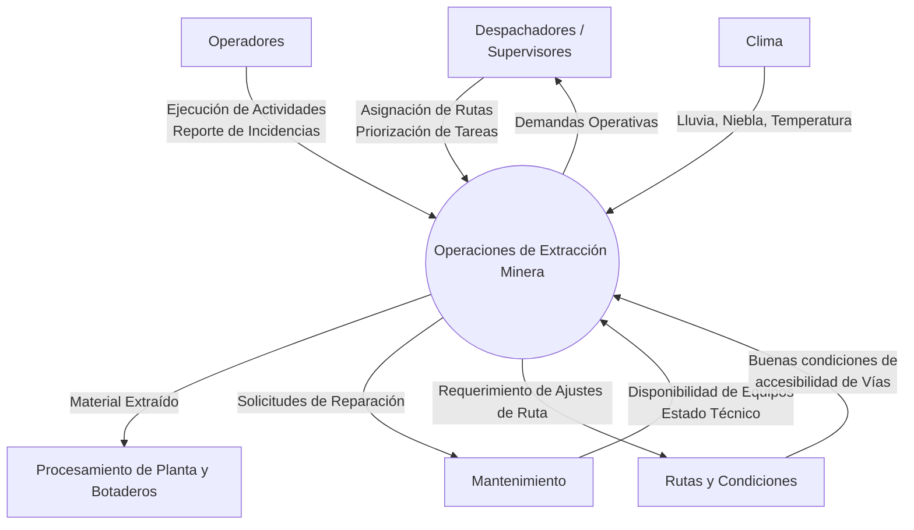

# diagrams

## system context diagram

Definir el alcance global del sistema, identificando los limites, actores externos y entradas/salidas relevantes para el consumo de diesel en operaciones de extraccion minera.

